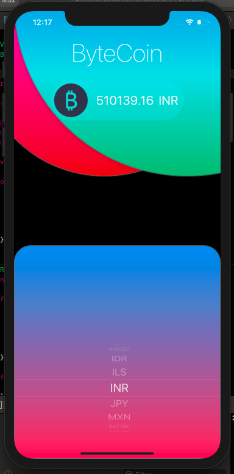
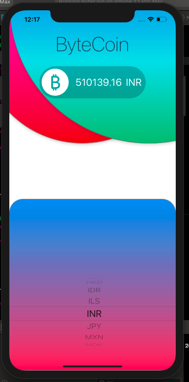

# ByteCoin
An iOS app thats displays the current value of Bitcoin(remember bitcoin?) in a wide range of currencies. Adapted to darkmode. Uses the BitcoinAverage API. App can be modified to display a wide range of currencies.

## Screenshots

 

## To Run
- Clone repo using Xcode Source Control
- Run app on preferred simulator

## Requirement
- iOS 13.x
- Xcode 11.x
